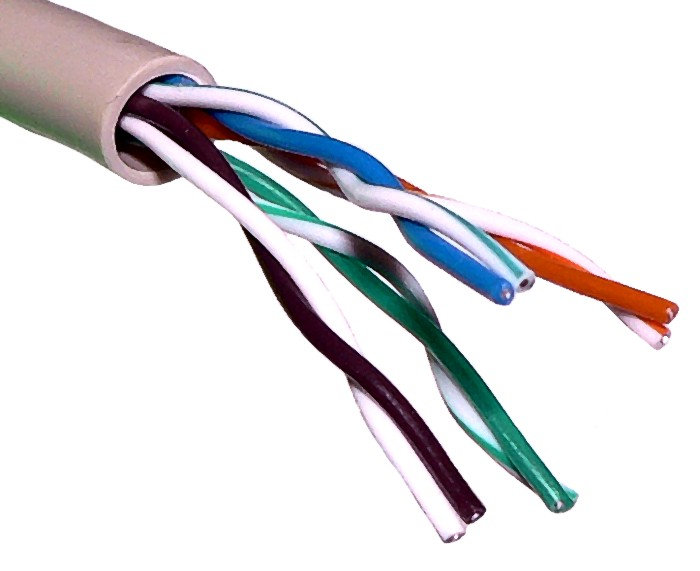
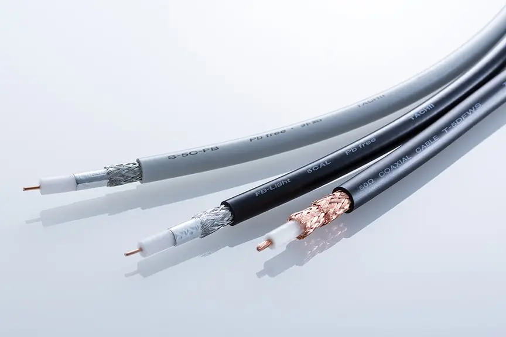
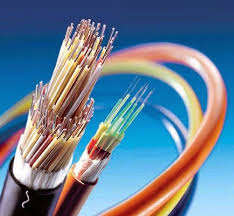
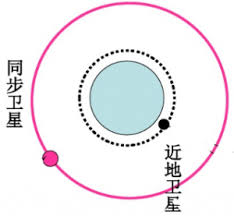
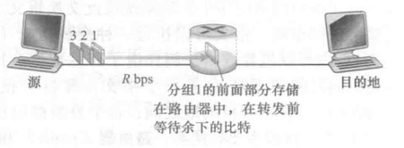

# 计算机网络和英特网

### 协议

`协议`定义了在`两个`或`多个`通讯实体之间交换的`报文的格式和顺序`，以及报文发送和/或接收一条报文或其他事件所采取的动作。

## 物理媒介

#### 双绞铜线

双绞线由两根绝缘的铜线组成，每根大约1m 粗，以规则的螺旋状排列着。这两根线被绞合起来，以减少邻近类似的双绞线的电气干 扰。通常许多双绞线捆扎在 一起形成 一根电缆，并在这些双绞线外面覆盖上保护性防护层。

### 同轴电缆

与双绞线类似，同轴电缆由两个铜导体组成，但是这两个导体是同心的而不是并行的.同轴电缆在电缆电视系统中相当普遍。我们前面已经看到，电缆电视系统最近与电 缆调制解调器结合起来，为住宅用户提供数十Mbps 速率的因特网接人。在电缆电视和 电缆因特网接人中，发送设备将数字信号调制到某个特定的频段，产生的模拟信号从发 送 设 备 传 送 到 一 个 或 多 个 接 收 方 。 同 轴 电 缆 能 被 用 作 导 引 型 共 享 媒 体

### 光纤

光纤是一种细而柔软的、能够导引光脉冲的媒体，每个脉冲表示一个比特。一根光 纤能够支持极高的比特速率，高达数十甚至数百Gbps。它们不受电磁干扰，长达100km 的光缆信号衰减极低，并且很难窃听

### 陆地无线电信道

陆地无线电信道 无线电信道承载电磁频谱中的信号。它不需要安装物理线路，并具有穿透墙壁、提供与 移 动 用 户 的 连 接以 及 长 距 离 承载 信 号 的 能 力 ， 因 而 成 为 一 种 有 吸 引 力 的 媒 体 。 无 线 电 信 道的特性极大地依赖于传播环境和信号传输的距离

### 卫星无线电信

同步卫星: 这种静止性是通过将卫星置于地球表面 上方36000km的轨道上而取得的。从地面站到卫星再回到地面站的巨大距离引入了可观
的280ms 信号传播时延。不过，能以数百Mbops 速率运 行的卫星链路通常用于那些无法使 用 D S L . 或 电 缆 因 特 网 接 人的 区 域

近地轨道卫星: 放置得非常靠近地球，并且不是永久地停留在地球上方的一个点。它们
围绕地球旋转，就像月亮围绕地球旋转那样，并且彼此之间可进行通信，也可以与地面站 通信。为了提供对 一个区域的连续覆盖，需要在轨道上放置许多卫星。当前有许多低轨道
通信系统在研制中

## 网络核心

### 分组

分组：为了从`源端系统`向`目的端`系统发送一个报文，源将长报文划`分为较小的数据块`，称之为分组

### 交换机

交 换 机 主 要 有 两 类: 路 由 器 (r o u t e r ) 和 链 路 层 交 换 机 (l i n k - l a y e r s w i t c h )。

### 存储转发传输

存储转发传输是指在交换机能够开始向输出链路传输该分组的第 一个比特之前，必须接 收 到 整 个 分组。

问题网络中为什么需要存储转发传输？

>  答案在同目录另一个文件里

