# 计算机网络和英特网

### 协议

`协议`定义了在`两个`或`多个`通讯实体之间交换的`报文的格式和顺序`，以及报文发送和/或接收一条报文或其他事件所采取的动作。

## 物理媒介

#### 双绞铜线

双绞线由两根绝缘的铜线组成，每根大约1m 粗，以规则的螺旋状排列着。这两根线被绞合起来，以减少邻近类似的双绞线的电气干 扰。通常许多双绞线捆扎在 一起形成 一根电缆，并在这些双绞线外面覆盖上保护性防护层。

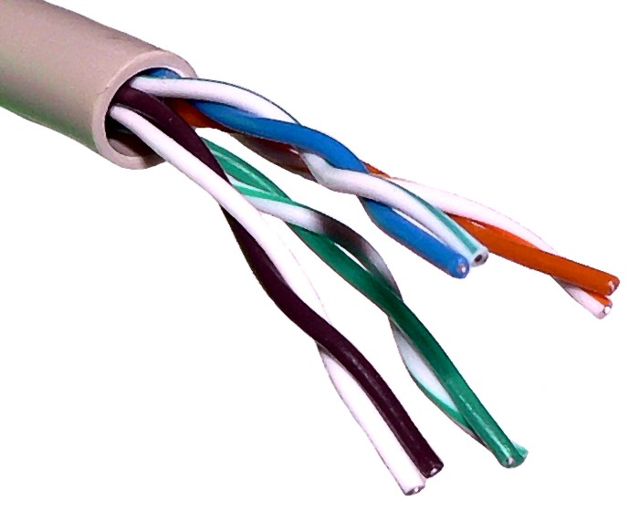

### 同轴电缆

与双绞线类似，同轴电缆由两个铜导体组成，但是这两个导体是同心的而不是并行的.同轴电缆在电缆电视系统中相当普遍。我们前面已经看到，电缆电视系统最近与电 缆调制解调器结合起来，为住宅用户提供数十Mbps 速率的因特网接人。在电缆电视和 电缆因特网接人中，发送设备将数字信号调制到某个特定的频段，产生的模拟信号从发 送 设 备 传 送 到 一 个 或 多 个 接 收 方 。 同 轴 电 缆 能 被 用 作 导 引 型 共 享 媒 体

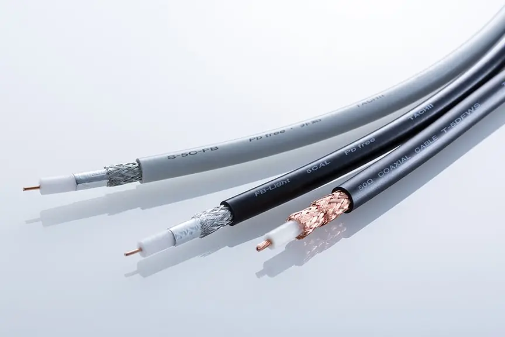

### 光纤

光纤是一种细而柔软的、能够导引光脉冲的媒体，每个脉冲表示一个比特。一根光 纤能够支持极高的比特速率，高达数十甚至数百Gbps。它们不受电磁干扰，长达100km 的光缆信号衰减极低，并且很难窃听

利用光信号，在光纤中传播。满足一定的折射率就可以传播的更远。

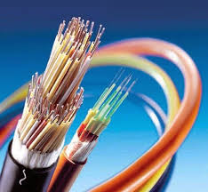

### 陆地无线电信道

陆地无线电信道 无线电信道承载电磁频谱中的信号。它不需要安装物理线路，并具有穿透墙壁、提供与 移 动 用 户 的 连 接以 及 长 距 离 承载 信 号 的 能 力 ， 因 而 成 为 一 种 有 吸 引 力 的 媒 体 。 无 线 电 信 道的特性极大地依赖于传播环境和信号传输的距离

### 卫星无线电信

同步卫星: 这种静止性是通过将卫星置于地球表面 上方36000km的轨道上而取得的。从地面站到卫星再回到地面站的巨大距离引入了可观
的280ms 信号传播时延。不过，能以数百Mbops 速率运 行的卫星链路通常用于那些无法使 用 D S L . 或 电 缆 因 特 网 接 人的 区 域

近地轨道卫星: 放置得非常靠近地球，并且不是永久地停留在地球上方的一个点。它们
围绕地球旋转，就像月亮围绕地球旋转那样，并且彼此之间可进行通信，也可以与地面站 通信。为了提供对 一个区域的连续覆盖，需要在轨道上放置许多卫星。当前有许多低轨道
通信系统在研制中

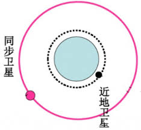

## 网络结构

* 网络边缘
  * 存在各种网络应用
* 网络核心
  * 把所有的边系统连接起来，进行数据交换
* 接入网，物理媒体：把边缘系统接入到网络核心

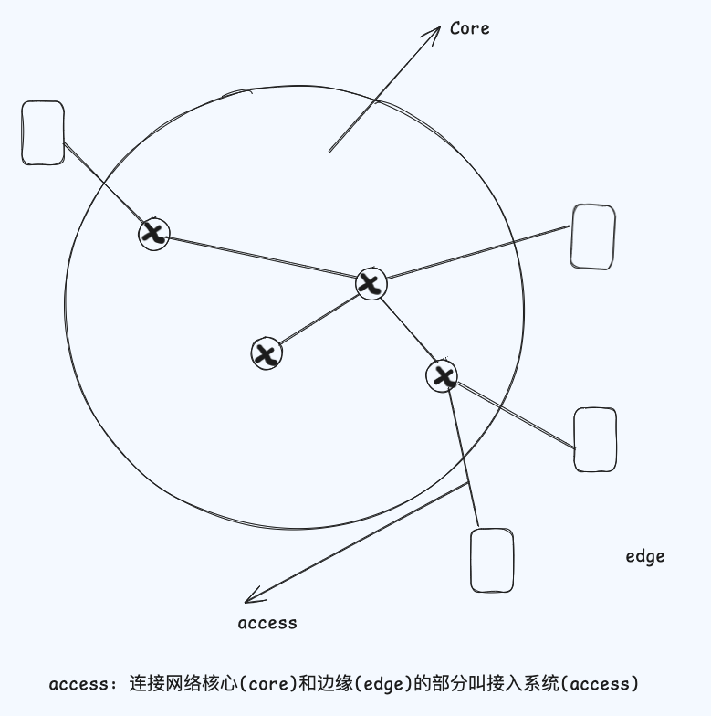

### 网络核心

#### 电路交换

端到端的资源被分配给从源端到目标端的呼叫“Call”

* 独享资源：不同享
  * 每个呼叫一旦建立起来就能够保证性能
* 如果呼叫没有数据发送，被分配的资源就会被浪费（no sharing）
* 通常被传统电话网络采用

网络资源（如宽带）被分成片，可以按照

1. 频分（FDM）
2. 时分（TDM）
3. 波分（WDM）

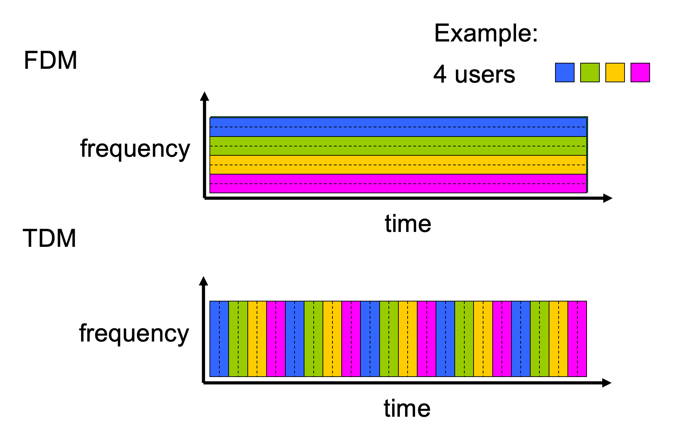

电路交换不适合计算机之间的通信

* 连接建立时间长
* 计算机之间的通信有突发性，如果使用线路交换，则浪费的片较多
  * 即是这个呼叫没有数据传递，其所占据的片也不能够被别的呼叫使用
* 可靠性不高？

#### 分组交换

以分组为单位存储-转发方式

* 网络宽带资源不在分为一个个片，传输时使用全部宽带
* 主机之间传输的数据被分为一个个分组
* 存储-转发：分组每次移动一跳
  * 在转发之前，节点必须收到整个分组
  * 延迟比线路交换要大
  * 排队时间

#### 分组

分组：为了从`源端系统`向`目的端`系统发送一个报文，源将长报文划`分为较小的数据块`，称之为分组

#### 交换机

交 换 机 主 要 有 两 类: 路 由 器 (r o u t e r ) 和 链 路 层 交 换 机 (l i n k - l a y e r s w i t c h )。

交换机是工作在链路层的网络交换设备

路由器是工作在网络层的网络交换设备

#### 存储转发传输

存储转发传输是指在交换机能够开始向输出链路传输该分组的第 一个比特之前，必须接 收 到 整 个 分组。

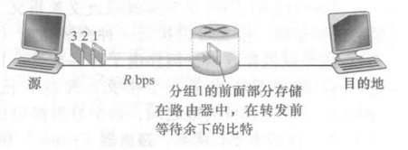

问题网络中为什么需要存储转发传输？

>  答案在同目录另一个文件里

#### 排队延迟和丢失

##### 排队和延迟

如果到达速率 > 链路的输出速率：

* 分组将会排队，等待传输
* 如果路由器的缓存用完了，分组将会被抛弃

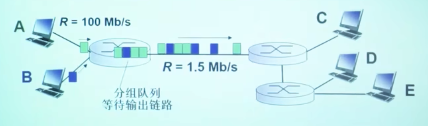

#### 网络核心的关键功能

* 路由：决定分组采用的源到目标的路径
  * 路由算法
* 转发：将分组从路由器的输入链路转移到输出链路

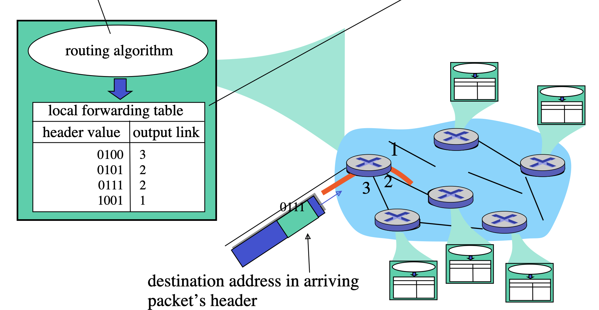

#### ISP

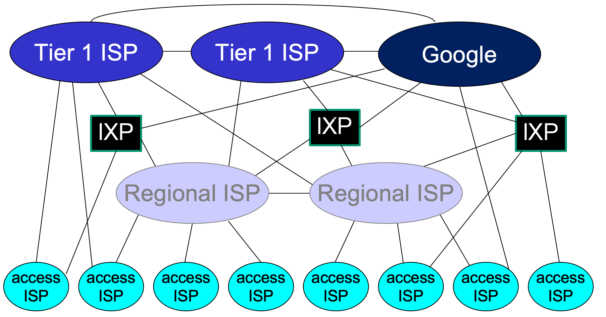

##### IXP: Internet exchange point

### 分组丢失和延迟是怎么发生的？

在路由器缓冲区的分组队列

1. 分组到达链路的速率超过了链路输出的能力
2. 分组等待排队对头, 被传输

### 四种分组延迟

1. 节点处理延时：
   * 检查 bit 级差错
   * 检查分组首部和决定将分组导向何处
   * 时间：通常是微妙数量级或更少
2. 排队延时
   * 在输出链路上等待传输的时间
   * 依赖于路由器拥塞程度
   * 时间：取决于拥塞程度
3. 传输延时
   * R = 链路带宽(bps)
   * L = 分组长度(bits)
   * 将分组发送到链路上的时间=L/R
   * 存储转发延时
   * 时间：= L/R，对低速率的链路而言很大（如拨号），通常为微秒级到毫秒级
4. 传播延时
   * d = 物理链路的长度
   * s = 在媒体上的传播速度(~2x10^8 m/sec)
   * 传播延时 = d/s
   * 时间：几微秒到几百毫秒

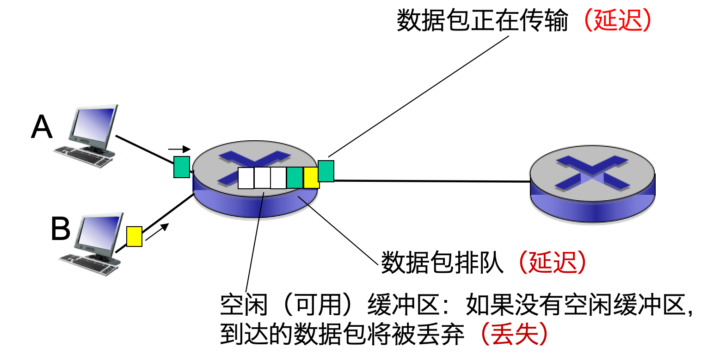

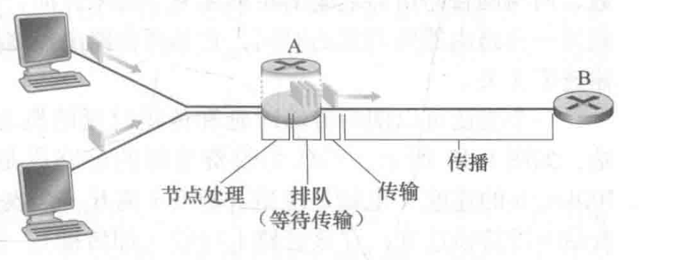

**总的时延 = 节点处理延时 + 排队延时 + 传输时延 + 传播时延**

流量强度介于0-1之间。

### 协议层次及其服务模型

分层的体系结构，就如一个人坐飞机的过程。

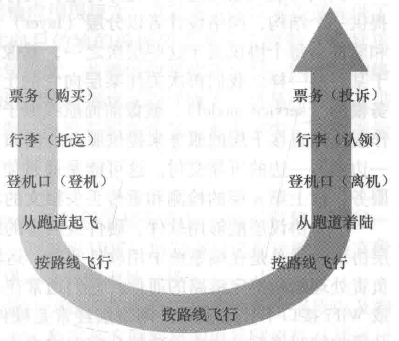

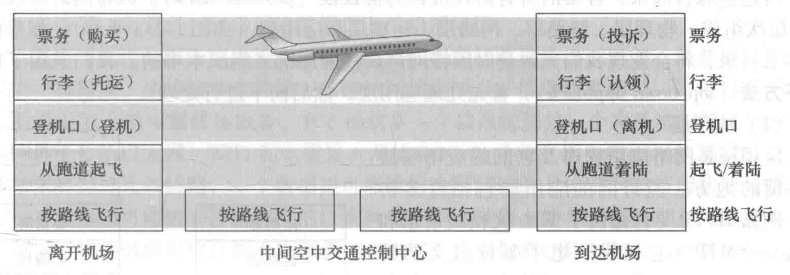

### 协议分层

#### 应用层

应用层是网络应用程序及它们的应用层协议存留的地方。因特网的应用层包括许都协议，例如：HTTP, SMTP, FTP.

我们把位于应用层的信息分组称为**报文**

#### 运输层

因特网的运输层在应用程序端点之间传送应用层报文。在因特网中，有两种运输协议，即TCP和UDP，利用其中的任一个都能跑运输应用层报文。

TCP提供面向连接的服务。包括了应用层报文向目的地确保传递和流量控制（即发送方/接收方速率匹配）。 TCP也将长报⽂划分为短报⽂ ， 并提供拥塞控制机 

DUP协议协议向它的应用程序提供无连接服务。没有可靠性， 没有流量控制，没有拥塞控制。

我们把位于运输层的分组称为**报文段**

#### 网络层

​		因特网的网络层负责将成为**数据报**的网络层分组从一台主机移动到另一台主机。在一台源主机中的因特网运输层协议（TCP或UDP）向网络层递交运输层报文段和目的地址，就像你通过邮政服务寄信时提供一个目的地址一样。

​		英特网的网络层包括著名的网际协议TCP，该协议定义了在数据报中的各个字段以及端系统和路由器如何作用于这些字段。因特网的网络层也包括决定路由的路由选择协议。它根据该路由将数据报从源传输到目的地。

#### 链路层

**链路层负责在同一个局域网的相邻节点之间，通过物理地址（MAC地址）来传输数据帧。**

#### 物理层

虽然链路层的任务是将整个帧从一个网络元素移动到邻近的网络元素，而物理层的任务是将该帧中的一个个比特从一个节点移动到下一个节点。在这层中的协议仍然是链路相关的，并且进一步与该链路（例如，双绞铜线，单模光纤）的实际传输媒体相关。

网络五层模型（TCP/IP五层或教学用五层模型）每一层作用的一句话总结：

*   **应用层 (Application Layer):** 直接面向用户，为应用程序提供网络通信服务并定义了通信协议（如HTTP、FTP）。

*   **传输层 (Transport Layer):** 负责在两个主机之间建立端到端的连接，通过端口号区分不同应用，并保证数据传输的可靠性（TCP）或高效性（UDP）。

*   **网络层 (Network Layer):** 通过IP地址在广域的、多个网络之间进行寻址和路由选择，负责将数据包从源主机发送到目标主机。

*   **链路层 (Data Link Layer):** 负责在同一个局域网的**相邻**节点之间，通过物理地址（MAC地址）来传输数据帧。传输以帧为单位的数据，在两个网卡之间。

*   **物理层 (Physical Layer):** 规定了物理设备和传输介质的电气特性，负责将原始的比特流（0和1）在物理介质上传输。传输比特。
