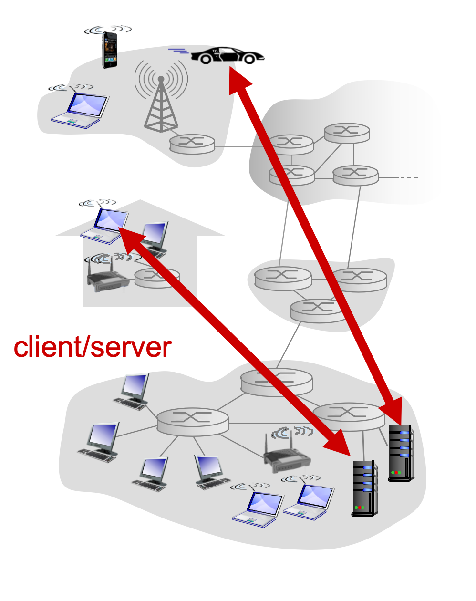
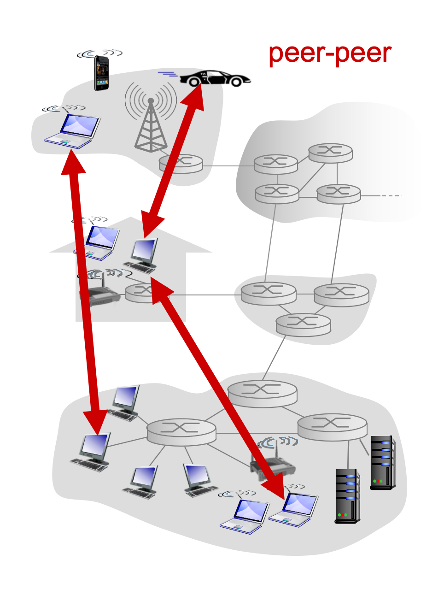

# 应用层

#### 网络应用的体系结构

##### 可能的应用架构

* 客户- 服务器模式（C/S：Client/Server）
* 对等模式（P2P：Peer To Peer）
* 混合体：客户 - 服务器和对等体系架构

### 客户 - 服务器模式（C/S）

#### 客户端

* 主动与服务器通信
* 与互联网有间歇性的连接
* 可能是动态IP地址
* 不直接与其他客户端通信

#### 服务器

* 一直运行
* 固定的IP地址和周知的端口号（约定）
* 扩展性：服务器场
  * 数据中心进行扩展
  * 扩展性差：到达一定预值，性能断崖式下降

### P2P

* （几乎）没有一直运行的服务器
* 任意端系统之间可以进行通信
* 每一个节点既是客户端又是服务器
  * 自扩展性 - 新peer节点带来新的服务能力，当然也带来新的服务请求
* 参与的主机间歇性连接且可以改变IP地址
  * 难以管理
* 例子：迅雷

### C/S 和 P2P体系结构的混合体

#### Napster

* 文件搜索：集中
  * 主机中心服务器上注册其资源
  * 主机向中心服务器查询资源位置
* 文件传输：P2P
  * 任意Peer节点之间

#### 即时通信

* 在线检查：集中
  * 当用户在线时，向中心服务器注册其IP地址
  * 用户与中心服务器联系，以找到其在线好友的位置
* 两个用户之间聊天：P2P
